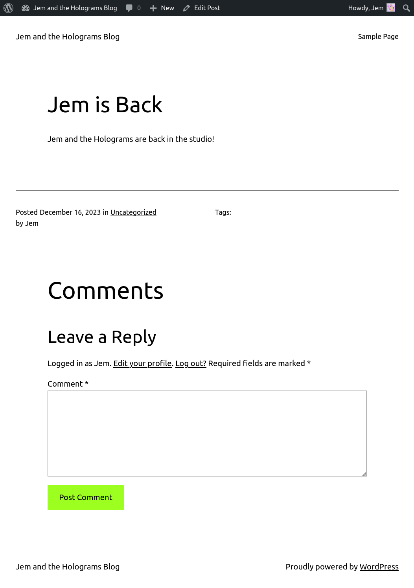
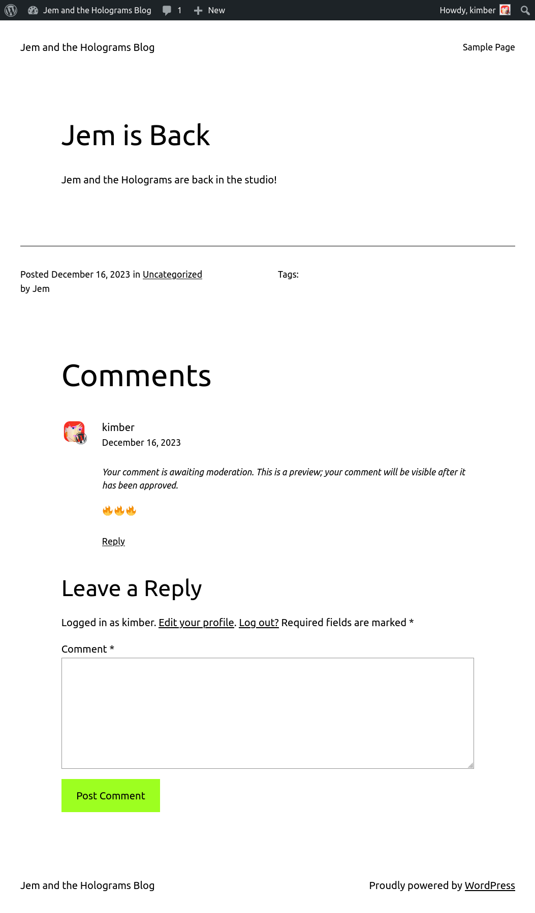
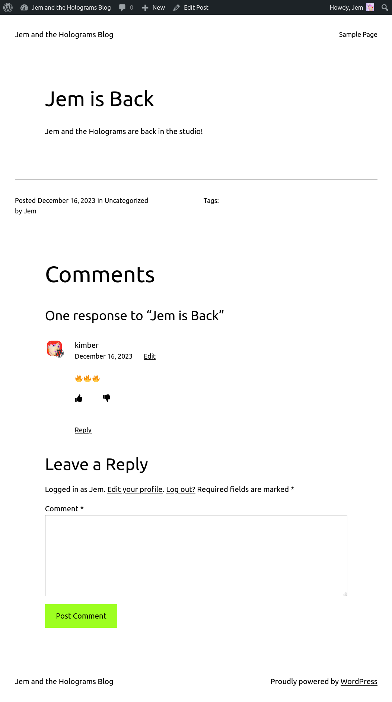
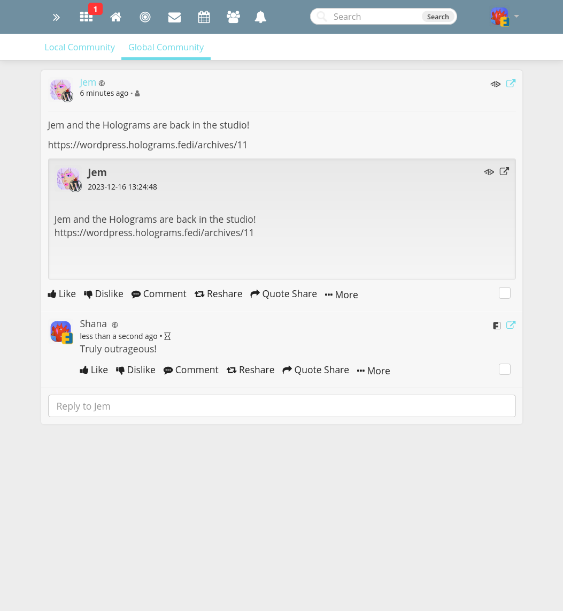
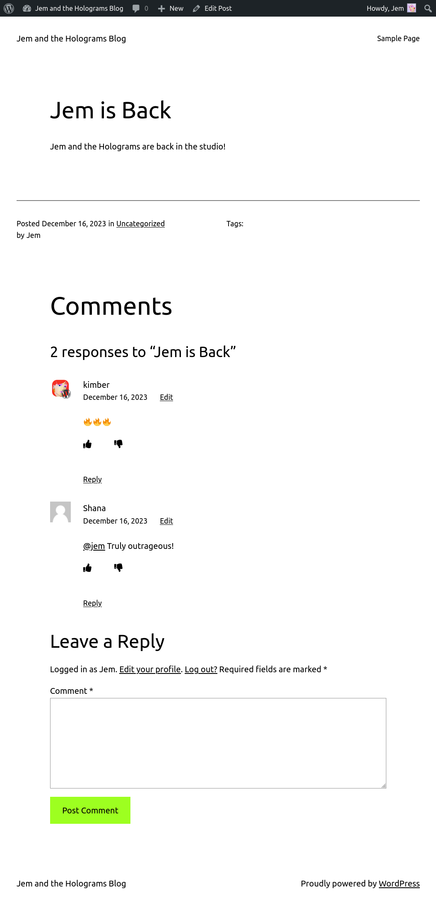
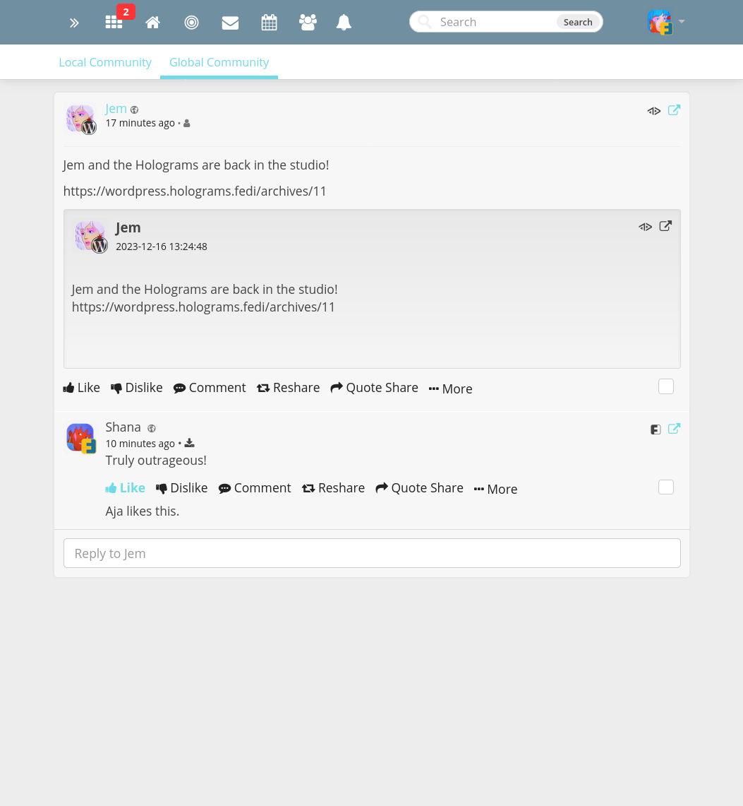
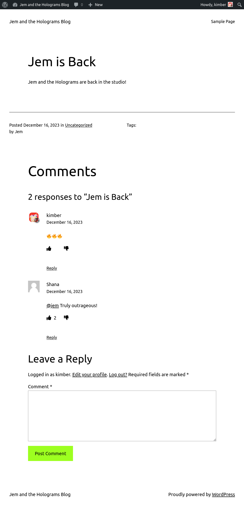
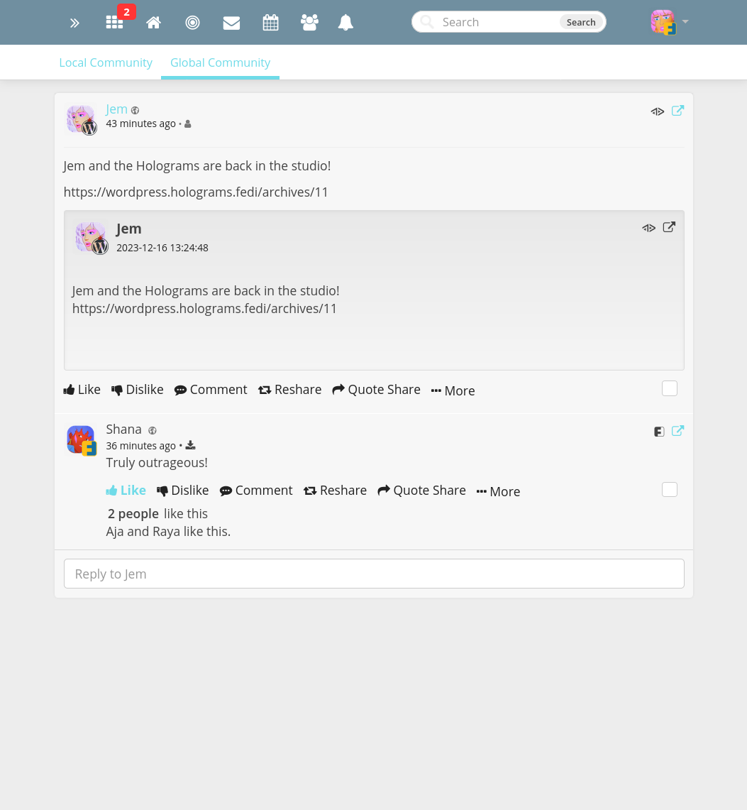

# activitypub_comments_like_dislike_shim

Shim to connect ActivityPub plugin to Comments Like Dislike plugin

This plugin allows "like" and "unlike" reactions from ActivityPub to show up on a Wordpress blog.

*This plugin is just a proof of concept, do not use it.*

## Demo

Jem is a Wordpress user.  She publishes a post.

Note that there are no like or dislike buttons on the post.  The Comments Like Dislike plugin, as its name suggests, allows likes and dislikes only on comments, not posts.

Kimber is another user of Jem's blog.  She makes a comment.

This comment goes into the moderation queue on the blog.  When Jem approves it, it shows up under the post.  Notice the like and dislike buttons.  As yet no-one has liked anything.

Shana is a Friendica user.  (Mastodon is more common than Friendica, but Friendica is what I'm familiar with.)  Because Jem's blog has the ActivityPub plugin activated, anyone in the Fediverse, including Shana, can see Jem's post.  In this case, Shana makes a comment.

This comment also goes into the moderation queue on Jem's blog, and after Jem approves it, it also shows up under the post.

Aja is another Friendica user.  She can see both Jem's post and Shana's comment.  But she cannot see Kimber's comment, because the ActivityPub plugin does not yet support federation of Wordpress comments.  (As of 2023-12-15 this feature is coming soon.)  So she has no ability to "like" Kimber's comment, but she can click "like" button on Shana's comment.

After a few minutes (Friendica uses a background process to publish messages) Aja's "like" arrives on the blog, so the "like" count now shows "1".

Kimber also sees Shana's comment and likes it.  Now the "like" count is "2".

Raya is yet another Friendica user.  She can see Shana's comment and Aja's "like", but not Shana's.  This is again because the ActivityPub plugin does not yet support federation of likes.  (And therefore the shim does not have any support either.)  So the like count she sees is just "1".  She likes the comment.  She now sees a "like" count of "2".

Again after a few minutes Raya's "like" arrives on the blog, and the count now shows "3".

## Installation

To use this, you need to install [the Comments Like Dislike plugin](https://en-ca.wordpress.org/plugins/comments-like-dislike/) and [the ActivityPub plugin](https://wordpress.org/plugins/activitypub/).  You then need to patch the Comments Like Dislike plugin with the supplied patch, like this:

    $ svn patch comments_like_dislike_cld_ajax_php.patch
    U         trunk/inc/classes/cld-ajax.php

I have [requested](https://wordpress.org/support/topic/feature-request-support-likes-from-activitypub-and-other-sources/) that the necessary changes be included in mainline, but there has been no response.

## Design

To make this work, the user needs three plugins: an ActivityPub plugin, a Comments Like Dislike plugin, and a weird "shim" plugin between the two.  Why don't they just talk directly to each other?

They could do that.  But there are other optional plugins that might consume events from the ActivityPub plugin, for example events or eCommerce plugins.  Meanwhile there are other possible sources of likes and dislikes for the Comments Like Dislike plugin, for example Bluesky or Matrix.  If both plugins have to support arbitrary numbers of partners, it greatly increases the maintenance cost.  This comes at the expense of people who only want one or the other, not both.

Instead, this small implementation assumes that both plugins design their own independent sets of Wordpress hooks built around their own use cases.  These can be stable, well-documented, and well-tested.  Then there would be a separately maintained project to join these plugins together.  As my code hopefully shows, the implementation can be very simple.

## Missing Functionality

This is just a proof of concept.  At least the following don't work:

* Dislikes (as opposed to Likes)
* Removing a like
* Sending local likes over ActivityPub

## Next Steps

The ActivityPub plugin has already been adapted in line with the above design.  The Comments Like Dislike plugin, however, doesn't work unmodified.  I would suggest the following approach:

* Move functionality that records and calculates from `cld-ajax.php` into a separate class.  This is probably a better design anyway.
* Switch from `cld_ips` and `cld_users` to a single meta value supporting arbitrary types of likes.  This would allow ActivityPub likes to have their own type.
* Add hooks to add and remove likes from any source, and hooks after a like has been recorded.
* Optionally, contrary to the design approach laid out above, actually include the relevant shims for ActivityPub.
